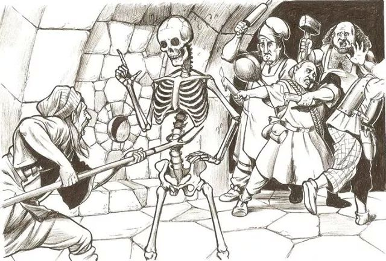

# Skelly

A small RPG set in the _Skeleton War_.

Have you ever wanted to:

* Battle f@ckboys in the [Skeleton War](https://knowyourmeme.com/memes/events/skeleton-war).
* Fight sick-@ss demons in Hell.
* Attain **+1 Calcium** to resist damage.
* Rescue the skeletons trapped in living bodies.

You might be able to do it in this RPG, because I haven't finished writing the
story yet.

This whole thing was inspired by this image, which I think was done by
[Jim Holloway](https://en.wikipedia.org/wiki/Jim_Holloway_(artist)):

The image has been popular on the Internet for quite a while; please let me
know the copyright status if you have some idea (or are Jim; dude, I loved
your work on the original _Paranoia_ books!).

## Credits

This is written in Lua, using the [LÖVE](https://love2d.org/) 2D game engine. I
didn't know about that until I stumbled on [CS50's Introduction to Game
Development](https://www.edx.org/course/cs50s-introduction-to-game-development).

Check the `.lua` file headers for individual credits; stuff I wrote is released
under the [MIT license](LICENSE.md).

### Graphics

* `skeleton` -
  [Skeleton Sprite](https://opengameart.org/content/skeleton-sprite) by
  [goo30](https://opengameart.org/users/goo30) on
  [OpenGameArt.org](https://opengameart.org/).

### Sounds

Sound resource credits go here.

### Music

Music resource credits go here.
